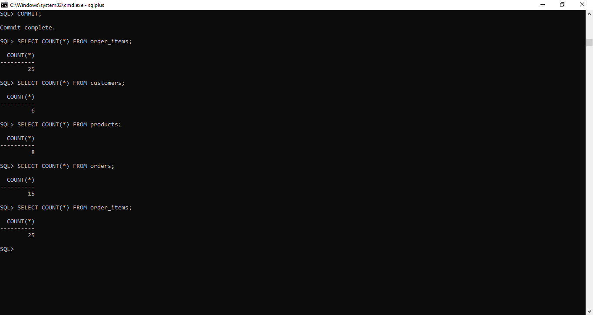
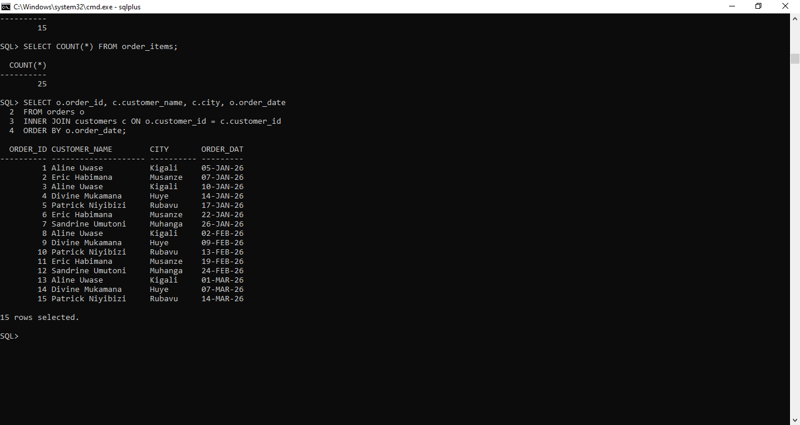
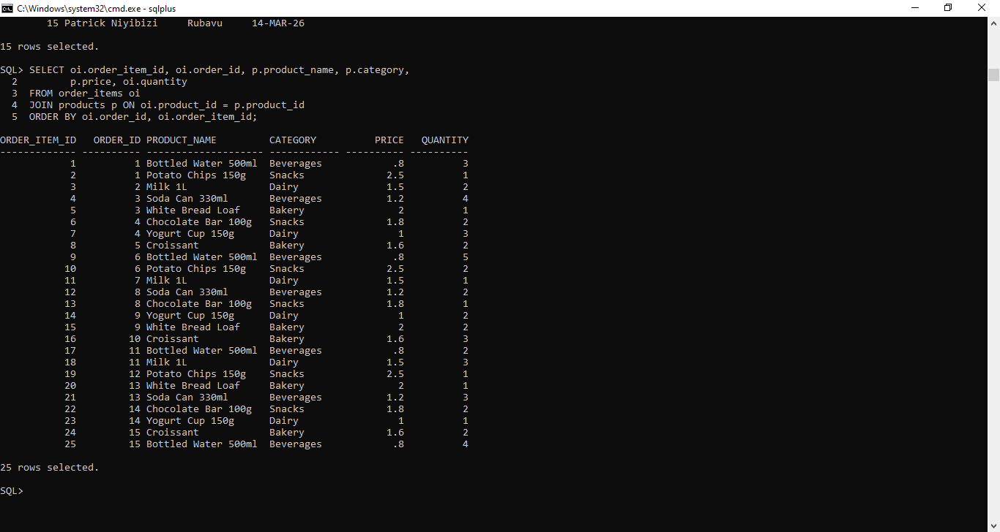
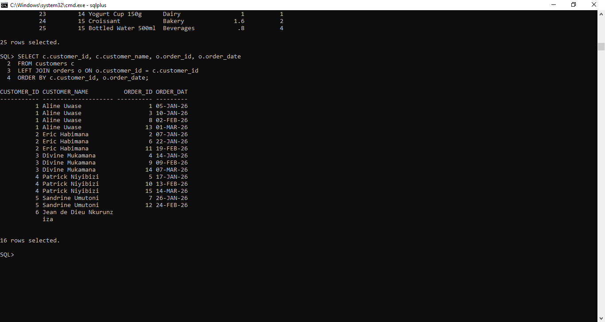
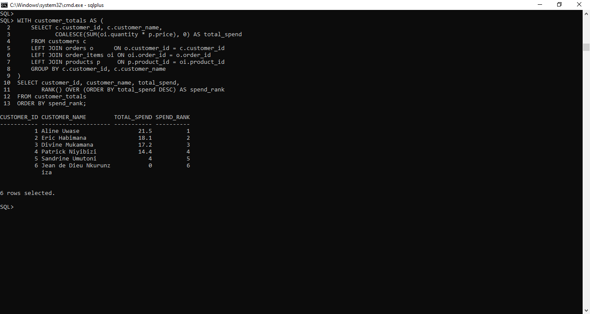
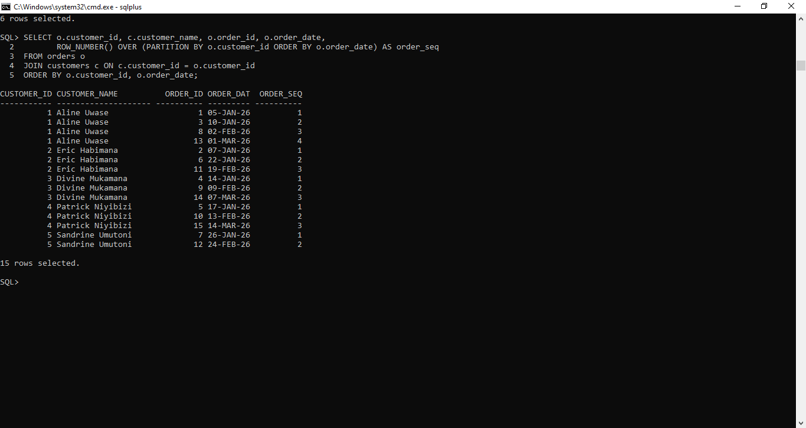
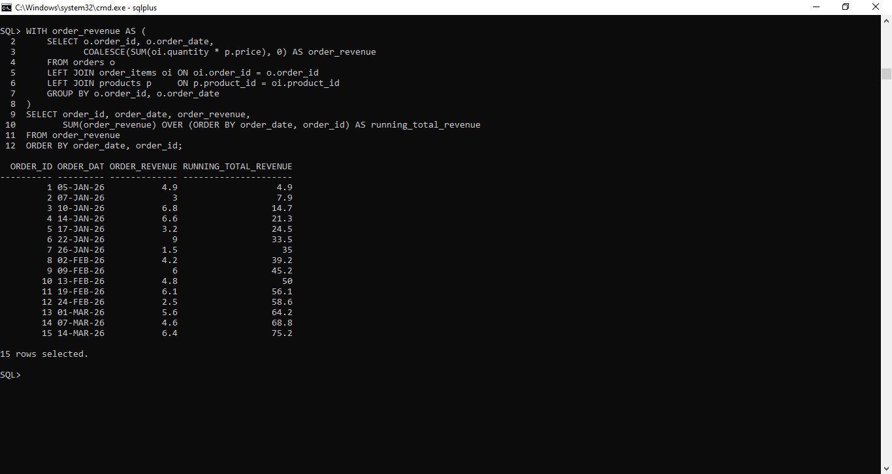
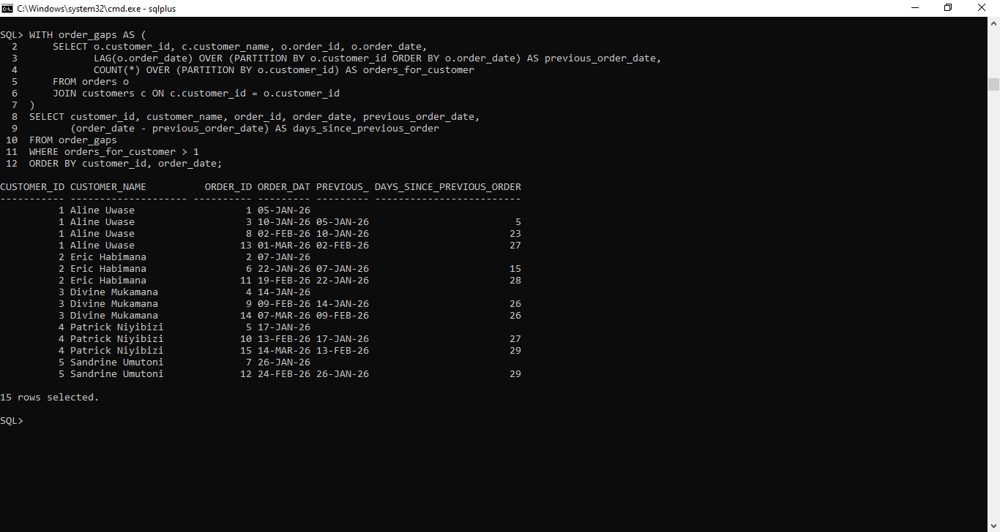

# PLSQL Assignment One / Sunrise Supermarket

**Name:** Kabanyana Sarah
**Student ID:** 20251SEN237
**Group:** D
**DBMS used:** Oracle Database 19c (via SQL*Plus)


## 1. Business Scenario

Sunrise Supermarket sells products to customers who place orders containing
one or more line items. Management wants three things out of this database:

1. **Who are our customers?** — basic profile and location data.
2. **What do they buy?** — product-level detail on every order (category,
   price, quantity).
3. **How are sales trending over time?** — order frequency, spend per
   customer, and revenue growth.

## The database models this with four tables:

| Table | Purpose |
|---|---|
| `customers` | One row per customer (id, name, email, city) |
| `products` | One row per product (id, name, category, price) |
| `orders` | One row per order (id, which customer, order date) |
| `order_items` | One row per line item on an order (which order, which product, quantity) |

An order can have many order items, and a customer can place many orders —
a standard one-to-many-to-many pattern.

## 2. Files in this Repository

| File | Contents |
|---|---|
| `schema.sql` | `CREATE TABLE` statements for all four tables |
| `seed_data.sql` | Sample data: 6 customers, 8 products (3 categories), 15 orders, 25 order items |
| `queries.sql` | All 8 required queries (3 JOINs, 1 CTE, 4 window functions) |
| `screenshots/` | SQL*Plus screenshots of each query's real output |
| `README.md` | This file |

> **Note on sample data:** the brief asks for *at least* 5 customers. I used
> **6** — the 6th (`Jean de Dieu Nkurunziza`) deliberately has **zero
> orders**, so the `LEFT JOIN` query actually demonstrates the behaviour
> it's meant to show (a customer row with `NULL` order columns) instead of
> looking identical to an `INNER JOIN`.

## 3. How to Run

Oracle 19c uses a multitenant (CDB) architecture, so a pluggable database
(PDB) has to be selected before creating an application user:

```sql
sqlplus system/12345

-- 1. See what PDBs exist
SELECT name, open_mode FROM v$pdbs;

-- 2. If your PDB shows MOUNTED instead of READ WRITE, open it
--    (requires SYS AS SYSDBA):
--    ALTER PLUGGABLE DATABASE ORCLPDB OPEN;
--    ALTER PLUGGABLE DATABASE ORCLPDB SAVE STATE;

-- 3. Switch the session into the PDB
ALTER SESSION SET CONTAINER = ORCLPDB;

-- 4. Create the application user inside the PDB
CREATE USER sunrise_supermarket IDENTIFIED BY YourPassword;
GRANT CONNECT, RESOURCE TO sunrise_supermarket;
ALTER USER sunrise_supermarket QUOTA UNLIMITED ON USERS;

--5. Reconnect as the new user (adjust host/port/service if different)
CONNECT sunrise_supermarket/YourPassword@localhost:1521/ORCLPDB
```

Then load the assignment files, in order:

```sql
SQL> @schema.sql
SQL> @seed_data.sql
SQL> @queries.sql
```

`schema.sql` drops any pre-existing tables first (wrapped in
`BEGIN...EXCEPTION` blocks so it doesn't error on a first-ever run), then
creates the four tables. `seed_data.sql` inserts the sample rows using
`TO_DATE(...)` for all date literals. `queries.sql` sets a few `SQL*Plus`
display options and runs all 8 required queries in order.

**Row counts after loading `seed_data.sql`:**




## 4. JOIN Queries

### JOIN 1 — Every order with customer name, city, and order date
**Type:** `INNER JOIN` between `orders` and `customers`.

```sql
SELECT o.order_id, c.customer_name, c.city, o.order_date
FROM orders o
INNER JOIN customers c ON o.customer_id = c.customer_id
ORDER BY o.order_date;
```

**Explanation:** each order belongs to exactly one customer, so an inner
join is sufficient — every order row matches exactly one customer row via
the `customer_id` foreign key.

**Expected results (15 rows) — verify against your own run:**

| order_id | customer_name | city | order_date |
|---|---|---|---|
| 1 | Aline Uwase | Kigali | 2026-01-05 |
| 2 | Eric Habimana | Musanze | 2026-01-07 |
| 3 | Aline Uwase | Kigali | 2026-01-10 |
| 4 | Divine Mukamana | Huye | 2026-01-14 |
| 5 | Patrick Niyibizi | Rubavu | 2026-01-17 |
| 6 | Eric Habimana | Musanze | 2026-01-22 |
| 7 | Sandrine Umutoni | Muhanga | 2026-01-26 |
| 8 | Aline Uwase | Kigali | 2026-02-02 |
| 9 | Divine Mukamana | Huye | 2026-02-09 |
| 10 | Patrick Niyibizi | Rubavu | 2026-02-13 |
| 11 | Eric Habimana | Musanze | 2026-02-19 |
| 12 | Sandrine Umutoni | Muhanga | 2026-02-24 |
| 13 | Aline Uwase | Kigali | 2026-03-01 |
| 14 | Divine Mukamana | Huye | 2026-03-07 |
| 15 | Patrick Niyibizi | Rubavu | 2026-03-14 |



**Business interpretation:** management can see at a glance which cities
are generating orders and how often each customer is coming back — Aline,
Eric, Divine, and Patrick order every couple of weeks, while Sandrine
orders less frequently.

---

### JOIN 2 — Every order item with product name, category, price, quantity
**Type:** plain `JOIN` between `order_items` and `products`.

```sql
SELECT oi.order_item_id, oi.order_id, p.product_name, p.category,
       p.price, oi.quantity
FROM order_items oi
JOIN products p ON oi.product_id = p.product_id
ORDER BY oi.order_id, oi.order_item_id;
```

**Explanation:** `order_items` only stores IDs (`order_id`, `product_id`),
so joining to `products` is required to see the human-readable name,
category, and price for each line item.



**Business interpretation:** this is the view a stock manager would use to
see exactly what's moving off the shelves order by order, broken down by
category (Beverages, Snacks, Dairy, Bakery).

---

### JOIN 3 — All customers and their orders, including customers with no orders
**Type:** `LEFT JOIN` from `customers` to `orders`.

```sql
SELECT c.customer_id, c.customer_name, o.order_id, o.order_date
FROM customers c
LEFT JOIN orders o ON o.customer_id = c.customer_id
ORDER BY c.customer_id, o.order_date;
```

**Explanation:** a `LEFT JOIN` keeps every row from `customers` even when
there's no matching row in `orders`. `Jean de Dieu Nkurunziza` (customer 6)
has never ordered, so his row appears once with `order_id` and
`order_date` both `NULL` — this is exactly the case an `INNER JOIN` would
have hidden.



**Business interpretation:** this is how management would find customers
who signed up but never bought anything — a natural target list for a
"welcome back" promotion.

---

## 5. CTE Query

### Customers with total spend above the store average

```sql
WITH customer_totals AS (
    SELECT c.customer_id, c.customer_name,
           COALESCE(SUM(oi.quantity * p.price), 0) AS total_spend
    FROM customers c
    LEFT JOIN orders o      ON o.customer_id = c.customer_id
    LEFT JOIN order_items oi ON oi.order_id = o.order_id
    LEFT JOIN products p     ON p.product_id = oi.product_id
    GROUP BY c.customer_id, c.customer_name
)
SELECT customer_id, customer_name, total_spend
FROM customer_totals
WHERE total_spend > (SELECT AVG(total_spend) FROM customer_totals)
ORDER BY total_spend DESC;
```

**Explanation:** the CTE (`customer_totals`) first computes every
customer's total spend (`quantity * price`, summed across all their order
items). `LEFT JOIN` + `COALESCE(...,0)` is used throughout so a customer
with zero orders still gets a real `0` row instead of disappearing —
otherwise the average would be calculated only over customers who bought
something, which would understate how many are "above average." The outer
query then filters to customers above that average.

**Expected results — verify against your own run:**

| customer_id | customer_name | total_spend |
|---|---|---|
| 1 | Aline Uwase | 21.50 |
| 2 | Eric Habimana | 18.10 |
| 3 | Divine Mukamana | 17.20 |
| 4 | Patrick Niyibizi | 14.40 |

Store average spend across all 6 customers ≈ **12.53**. Sandrine (4.00) and
Jean (0.00) fall below it and are excluded.


**Business interpretation:** these four customers are the store's most
valuable — a loyalty program or targeted upsell would focus here first.

---

## 6. Window-Function Queries

### WINDOW 1 — Rank customers by total spend, highest first

```sql
WITH customer_totals AS (
    SELECT c.customer_id, c.customer_name,
           COALESCE(SUM(oi.quantity * p.price), 0) AS total_spend
    FROM customers c
    LEFT JOIN orders o      ON o.customer_id = c.customer_id
    LEFT JOIN order_items oi ON oi.order_id = o.order_id
    LEFT JOIN products p     ON p.product_id = oi.product_id
    GROUP BY c.customer_id, c.customer_name
)
SELECT customer_id, customer_name, total_spend,
       RANK() OVER (ORDER BY total_spend DESC) AS spend_rank
FROM customer_totals
ORDER BY spend_rank;
```

**Explanation:** `RANK() OVER (ORDER BY total_spend DESC)` assigns rank 1
to the highest spender, working down the list; ties would share a rank
and skip the next number (unlike `DENSE_RANK`).

**Expected results:**

| customer_id | customer_name | total_spend | spend_rank |
|---|---|---|---|
| 1 | Aline Uwase | 21.50 | 1 |
| 2 | Eric Habimana | 18.10 | 2 |
| 3 | Divine Mukamana | 17.20 | 3 |
| 4 | Patrick Niyibizi | 14.40 | 4 |
| 5 | Sandrine Umutoni | 4.00 | 5 |
| 6 | Jean de Dieu Nkurunziza | 0.00 | 6 |



**Business interpretation:** an instant "top customers" leaderboard for a
loyalty tier or a personalized thank-you offer.

---

### WINDOW 2 — Number each customer's orders in the order placed

```sql
SELECT o.customer_id, c.customer_name, o.order_id, o.order_date,
       ROW_NUMBER() OVER (PARTITION BY o.customer_id ORDER BY o.order_date) AS order_seq
FROM orders o
JOIN customers c ON c.customer_id = o.customer_id
ORDER BY o.customer_id, o.order_date;
```

**Explanation:** `PARTITION BY customer_id` restarts the numbering for
each customer, and `ORDER BY order_date` numbers their orders 1, 2, 3...
in the order they were actually placed.



**Business interpretation:** useful for "welcome to your 2nd order" style
targeted discounts aimed at encouraging repeat purchases.

---

### WINDOW 3 — Running total of revenue over time

```sql
WITH order_revenue AS (
    SELECT o.order_id, o.order_date,
           COALESCE(SUM(oi.quantity * p.price), 0) AS order_revenue
    FROM orders o
    LEFT JOIN order_items oi ON oi.order_id = o.order_id
    LEFT JOIN products p     ON p.product_id = oi.product_id
    GROUP BY o.order_id, o.order_date
)
SELECT order_id, order_date, order_revenue,
       SUM(order_revenue) OVER (ORDER BY order_date, order_id) AS running_total_revenue
FROM order_revenue
ORDER BY order_date, order_id;
```

**Explanation:** the inner CTE computes revenue per order; the outer
`SUM(...) OVER (ORDER BY order_date, order_id)` (no `PARTITION BY`)
accumulates that revenue cumulatively across the whole store.

**Expected results (final running total ≈ 75.20):**

| order_id | order_date | order_revenue | running_total_revenue |
|---|---|---|---|
| 1 | 2026-01-05 | 4.90 | 4.90 |
| 2 | 2026-01-07 | 3.00 | 7.90 |
| 3 | 2026-01-10 | 6.80 | 14.70 |
| 4 | 2026-01-14 | 6.60 | 21.30 |
| 5 | 2026-01-17 | 3.20 | 24.50 |
| 6 | 2026-01-22 | 9.00 | 33.50 |
| 7 | 2026-01-26 | 1.50 | 35.00 |
| 8 | 2026-02-02 | 4.20 | 39.20 |
| 9 | 2026-02-09 | 6.00 | 45.20 |
| 10 | 2026-02-13 | 4.80 | 50.00 |
| 11 | 2026-02-19 | 6.10 | 56.10 |
| 12 | 2026-02-24 | 2.50 | 58.60 |
| 13 | 2026-03-01 | 5.60 | 64.20 |
| 14 | 2026-03-07 | 4.60 | 68.80 |
| 15 | 2026-03-14 | 6.40 | 75.20 |



**Business interpretation:** revenue climbs steadily to 75.20 over the
quarter — plotting this is exactly how management would build a sales
trend chart.

---

### WINDOW 4 — Days between current and previous order (customers with >1 order)

```sql
WITH order_gaps AS (
    SELECT o.customer_id, c.customer_name, o.order_id, o.order_date,
           LAG(o.order_date) OVER (PARTITION BY o.customer_id ORDER BY o.order_date) AS previous_order_date,
           COUNT(*) OVER (PARTITION BY o.customer_id) AS orders_for_customer
    FROM orders o
    JOIN customers c ON c.customer_id = o.customer_id
)
SELECT customer_id, customer_name, order_id, order_date, previous_order_date,
       (order_date - previous_order_date) AS days_since_previous_order
FROM order_gaps
WHERE orders_for_customer > 1
ORDER BY customer_id, order_date;
```

**Explanation:** `LAG(order_date)` looks back one row within each
customer's own order history to fetch their previous order date;
subtracting dates gives the day gap directly in Oracle (`DATE - DATE`
returns a `NUMBER`). `COUNT(*) OVER (PARTITION BY customer_id)` filters out
any customer with only one order, satisfying the "more than one order"
requirement without a separate `GROUP BY`/`HAVING` pass.

**Expected results:**

| customer_id | customer_name | order_id | order_date | previous_order_date | days_since_previous_order |
|---|---|---|---|---|---|
| 1 | Aline Uwase | 3 | 2026-01-10 | 2026-01-05 | 5 |
| 1 | Aline Uwase | 8 | 2026-02-02 | 2026-01-10 | 23 |
| 1 | Aline Uwase | 13 | 2026-03-01 | 2026-02-02 | 27 |
| 2 | Eric Habimana | 6 | 2026-01-22 | 2026-01-07 | 15 |
| 2 | Eric Habimana | 11 | 2026-02-19 | 2026-01-22 | 28 |
| 3 | Divine Mukamana | 9 | 2026-02-09 | 2026-01-14 | 26 |
| 3 | Divine Mukamana | 14 | 2026-03-07 | 2026-02-09 | 26 |
| 4 | Patrick Niyibizi | 10 | 2026-02-13 | 2026-01-17 | 27 |
| 4 | Patrick Niyibizi | 15 | 2026-03-14 | 2026-02-13 | 29 |
| 5 | Sandrine Umutoni | 12 | 2026-02-24 | 2026-01-26 | 29 |

*(each customer's first order has `NULL` in `previous_order_date` and is
excluded from the "meaningful gap" table above, but still appears in the
raw screenshot below)*



**Business interpretation:** most customers reorder roughly every 3-4
weeks. This is exactly how a "customer is overdue for a reorder" alert
would be built — flag anyone whose current gap exceeds their historical
average by some margin.

---

## 7. Challenges & Resolutions

1. **Getting a usable Oracle user set up at all.** `CREATE DATABASE`
   failed with `ORA-01100: database already mounted` — a fresh install
   already has a mounted database, so only a new schema was needed, not a
   new instance. Then `CREATE USER` in the root container needed a
   `C##`-prefixed name because Oracle 19c is multitenant; running
   `SELECT name, open_mode FROM v$pdbs;` found the real PDB name
   (`ORCLPDB`), and `ALTER SESSION SET CONTAINER = ORCLPDB;` before
   creating the user solved it, since ordinary usernames are allowed
   inside a PDB.
2. **`LEFT JOIN` looked identical to `INNER JOIN` at first.** With every
   customer having at least one order, Query 3 produced the same rows as
   an inner join. Resolution: added a 6th customer with zero orders so the
   `NULL`-filled row actually appears.
3. **Customers with no orders would disappear from the CTE totals.** A
   plain `INNER JOIN` from `customers` to `orders`/`order_items`/`products`
   inside the CTE would silently drop any customer with no orders.
   Resolution: used `LEFT JOIN`s throughout and wrapped the sum in
   `COALESCE(...,0)` so every customer gets a real `0` row.
4. **Excluding single-order customers from the `LAG` query.** A `HAVING
   COUNT(*) > 1` clause doesn't combine cleanly with a windowed `LAG` in
   the same query. Resolution: computed `COUNT(*) OVER (PARTITION BY
   customer_id)` as its own window function and filtered on it in the
   outer query.

*(add any real problems you personally ran into while running this —
this section should reflect what actually happened on your machine)*

---

## 8. Summary

All required elements are implemented: 3 JOIN queries (inner, plain join,
left join), 1 CTE-based above-average spend analysis, and 4
window-function queries (`RANK`, `ROW_NUMBER`, windowed `SUM` for running
total, and `LAG` for day-gaps), each with an explanation, expected/actual
output, and a business interpretation above.
